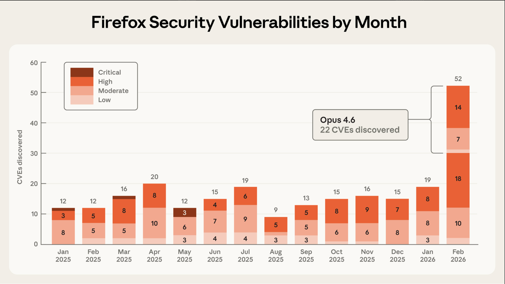
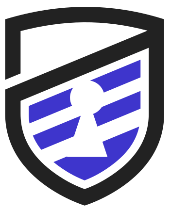

# Cloud Therapy
<!-- theme: midnight -->
<!-- timing: 1.0 -->
<!-- ascii_title -->
<!-- fullscreen -->

<!-- loop_animation: sparkle(figlet) -->
<!-- transition: dissolve -->
<!-- align: center -->
<!-- font_size: 6 -->
<!-- footer: Bailey Belisario — https://zonemix.tech -->
<!-- footer_align: center -->

Hi! My name is cloud and I have trust issues!

---

# About Me
<!-- theme: midnight -->
<!-- section: opening -->
<!-- timing: 1.5 -->
<!-- transition: dissolve -->
<!-- animation: fade_in -->
<!-- font_size: 6 -->

- Bailey Belisario | https://zonemix.tech
- Married to my spouse
- Father to my kids

---

# About Me
<!-- theme: midnight -->
<!-- section: opening -->
<!-- timing: 0.5 -->
<!-- animation: typewriter -->
<!-- transition: dissolve -->
<!-- font_size: 6 -->

- Dakota State University alum (BS Cyber Ops, MS Computer Science)
- Former Research Engineer @ DSU (3+ years)
- Former Adjunct Instructor @ DSU (3 years)
- Former contractor at a large tech company (7 months)

---

# A Quick Note
<!-- theme: midnight -->
<!-- section: opening -->
<!-- timing: 1.0 -->
<!-- animation: fade_in -->
<!-- font_size: 6 -->


<!-- image_render: kitty -->
<!-- image_scale: 50 -->

- Technical Consultant, Advanced Assessments @ Neuvik
- Offensive Security and Cyber Risk Management
- https://neuvik.com

---

# Welcome to Group Therapy
<!-- theme: midnight -->
<!-- section: opening -->
<!-- timing: 1.0 -->
<!-- animation: fade_in -->
<!-- title_decoration: underline -->
<!-- transition: dissolve -->
<!-- font_size: 6 -->

- Why Cloud Therapy?
- This is a safe space
- No judgment, we have all misconfigured something
- If you feel personally attacked by a slide, that is called a breakthrough
- Laughter is encouraged, it is a coping mechanism

**Disclaimer: All stories from real engagements. All *details anonymized. All pain authentic.*

---

# My Own Confession
<!-- theme: midnight -->
<!-- section: opening -->
<!-- timing: 1.5 -->
<!-- animation: fade_in -->
<!-- transition: dissolve -->
<!-- font_size: 6 -->

**A Little Over a Year Ago, I Needed MAJOR Help**

- December '24: What is AWS, Azure, GCP?
- IaC? Terraform?? Kubernetes??? DevSecOps????
- Didn't know any of it, but was willing to learn
- 2025: 7 red team assessments in the cloud
- AWS & Azure (poor GCP, sad face)

---

# Today's Agenda — What You'll Hear
<!-- theme: midnight -->
<!-- section: opening -->
<!-- timing: 1.0 -->
<!-- animation: typewriter -->
<!-- transition: dissolve -->
<!-- font_size: 6 -->

- 4 patients
- Every diagnosis is paired with a prescription
- Tactics you can use Monday morning (red/blue/purple)
- Concrete treatment plans, not vague advice
- Focus on AWS, not too much at once

---

# Today's Agenda — What You Won't Hear
<!-- theme: midnight -->
<!-- section: opening -->
<!-- timing: 1.0 -->
<!-- animation: slide_down -->
<!-- transition: slide -->
<!-- font_size: 6 -->

**What You Won't Hear**
- Vendor slides
- Zero-days
- "buy this product"
- Shame without help

<!-- reset_layout -->

---

# Group Check-In — No Judgement
<!-- theme: midnight -->
<!-- section: opening -->
<!-- timing: 1.0 -->
<!-- theme: frost_glass -->
<!-- animation: fade_in -->
<!-- transition: slide -->
<!-- title_decoration: underline -->
<!-- font_size: 6 -->

**Raise your hand if...**

- ...you are not sure what IMDSv2 is
- ...you have felt completely lost in a cloud console
- ...you have an IAM key older than 90 days
- ...you have ever said "that alert is probably nothing"
- ...you have a trust policy with `Principal: "*"`

---

# Session 1: Patient Denial
<!-- section: story1 -->
<!-- theme: cyber_red -->
<!-- timing: 0.5 -->
<!-- ascii_title -->
<!-- loop_animation: sparkle(figlet) -->
<!-- transition: dissolve -->
<!-- font_size: 4 -->

The Policy That Did Nothing

*"I'm fine. My deny policies are working. Everything is fine."*

---

# Presenting Symptoms
<!-- section: story1 -->
<!-- theme: cyber_red -->
<!-- timing: 1.5 -->
<!-- animation: fade_in -->
<!-- font_size: 7 -->

```diagram style=box
# Patient History: "I'm Restricting Access, I Promise"
Phishing -> "Admin" Creds -> Deny Policies
 Deny Policies -> AdministratorAccess
: broken  : stolen credentials
```

- Spear phishing campaign provided a "restricted" admin account
- `AdministratorAccess` attached w/ explicit deny policies
- `deny_autoscaling`, `deny_ec2_securitygroups`, `deny_s3_by_tag`...
- The patient thought these policies were protecting them
- The denial was...strong

---

<!-- section: story1 -->
<!-- theme: cyber_red -->
<!-- timing: 1.0 -->
<!-- animation: fade_in -->
<!-- font_size: 6 -->

```json {label: "Hmm, what's wrong here?"}
{
  "Version": "2012-10-17",
  "Statement": [
    {
      "Sid": "S3Actions",
      "Effect": "Deny",
      "Action": [
        "s3:*"
      ],
      "Resource": "*",
      "Condition": {
        "StringEquals": {
          "aws:ResourceTag/ResourceOwner": "demo-owner"
        }
      }
    }
  ]
}
```

---

# The Condition
<!-- section: story1 -->
<!-- theme: cyber_red -->
<!-- timing: 1.0 -->
<!-- animation: fade_in -->
<!-- font_size: 6 -->

- `aws:ResourceTag` is not supported for S3 in deny statements
- This policy evaluates to...nothing. It is a placebo.
- AWS documents it
- IAM Access Analyzer catches it.

---

# Let's Run a Test
<!-- section: story1 -->
<!-- theme: cyber_red -->
<!-- timing: 1.5 -->
<!-- transition: dissolve -->
<!-- animation: fade_in -->
<!-- font_size: 6 -->

Let's confirm the diagnosis.

```bash +exec {label: "LIVE: The deny policy does nothing"}
bash demos/story1_attack.sh
```

---

# Diagnosis
<!-- section: story1 -->
<!-- theme: cyber_red -->
<!-- timing: 1.5 -->
<!-- animation: fade_in -->
<!-- font_size: 6 -->

```diagram style=box
S3 Access -> tfstate -> Passwords
Passwords -> K8s Tokens -> RDS -> Customer Data
```

- Full S3 access led to Terraform state files
- tfstate contained passwords, AWS access keys, API tokens
- One Kubernetes service account token — admin over the entire cluster
- K8s secrets -> RDS database -> customer records
- Zero detection from the blue team

---

# Prescription: Patient Denial
<!-- section: story1 -->
<!-- theme: cyber_red -->
<!-- timing: 1.5 -->
<!-- transition: slide -->
<!-- animation: fade_in -->
<!-- column_layout: [1, 1] -->
<!-- column: 0 -->
<!-- font_size: 6 -->

**Rx: PREVENT**
- Replace `aws:ResourceTag` with VPC endpoint conditions
- Run IAM Access Analyzer in CI/CD
- Block deploys on policy findings
- Encrypt and isolate tfstate files

<!-- column: 1 -->

**Rx: DETECT**
- CloudTrail `GetObject` bulk read detection
- Alert on 50+ reads/hour from same identity
- CloudWatch Insights for S3 anomalies

<!-- reset_layout -->

The cure for this denial is validation. Prove your policies work.

---

# Rx: Corrected Deny Policy
<!-- section: story1 -->
<!-- theme: cyber_red -->
<!-- timing: 1.5 -->
<!-- transition: slide -->
<!-- animation: fade_in -->
<!-- font_size: 5 -->

```json {label: "Uses VPC endpoint conditions (actually supported)"}
{
  "Version": "2012-10-17",
  "Statement": [{
    "Sid": "DenyS3OutsideVPC",
    "Effect": "Deny",
    "Action": "s3:*",
    "Resource": [
      "arn:aws:s3:::sensitive-bucket-*",
      "arn:aws:s3:::sensitive-bucket-*/*"
    ],
    "Condition": {
      "StringNotEquals": {
        "aws:SourceVpce": "vpce-0123456789abcdef0"
      }
    }
  }]
}
```

---

# Rx: Detection Query
<!-- section: story1 -->
<!-- theme: cyber_red -->
<!-- timing: 1.5 -->
<!-- transition: slide -->
<!-- animation: fade_in -->
<!-- font_size: 5 -->

```sql {label: "CloudTrail: Detect Bulk S3 Reads"}
SELECT userIdentity.arn,
       sourceIPAddress,
       COUNT(*) as request_count
FROM cloudtrail_logs
WHERE eventSource = 's3.amazonaws.com'
  AND eventName = 'GetObject'
  AND eventTime > date_add('hour', -1, now())
GROUP BY userIdentity.arn, sourceIPAddress
HAVING COUNT(*) > 50
ORDER BY request_count DESC
```

- 50+ GetObject calls in an hour from the same identity = the exact pattern we generated
- If they had this running, they would have caught us

---

# The Cure
<!-- section: story1 -->
<!-- theme: cyber_red -->
<!-- timing: 1.0 -->
<!-- transition: slide -->
<!-- font_size: 6 -->

```bash +exec {label: "LIVE: IAM Access Analyzer catches the broken policy"}
bash demos/story1_defense.sh
```

- IAM Access Analyzer flags the unsupported condition key
- 5-second check. Free. Would have prevented everything.
- The cure for Denial is validation.

---

# Session 2: Patient Trust Issues
<!-- section: story2 -->
<!-- theme: terminal_green -->
<!-- timing: 0.5 -->
<!-- ascii_title -->
<!-- loop_animation: sparkle(figlet) -->
<!-- transition: dissolve -->
<!-- font_size: 6 -->

From EKS Node to Domain Controller

*"I trust everyone. What could go wrong?"*

---

# Presenting Symptoms
<!-- section: story2 -->
<!-- theme: terminal_green -->
<!-- timing: 1.0 -->
<!-- animation: fade_in -->
<!-- font_size: 6 -->

```diagram style=box
EKS Node -> IMDS Creds -> Cross-Account -> AD Admin
: recon  : IMDSv1 : No ExternalId : Kerberoast
```

- We landed on an EKS node — not an admin
- Read IAM roles, trust policies, internal docs
- Found references to a cross-account role
- Guessed the role name and tried it — it worked
- Chained back to the original account as admin
- No ExternalId on any hop

---

# The Root Cause: No Boundaries
<!-- section: story2 -->
<!-- theme: terminal_green -->
<!-- timing: 2.0 -->
<!-- animation: fade_in -->
<!-- font_size: 6 -->

```bash {label: "Hop 1: EKS Node -> Root (ssm-user has NOPASSWD sudo)"}
# The ssm-user default -- not a bug, a "feature"
$ whoami
ssm-user

$ sudo -l
User ssm-user may run the following commands:
    (ALL) NOPASSWD: ALL

$ sudo su -
# whoami
root
```

```bash {label: "Hop 2: Root -> IMDS Credential Theft"}
# IMDSv1: just curl it. No token needed!
curl -s http://169.254.169.254/latest/meta-data/iam/security-credentials/EKS-Node-Role

# Returns: AccessKeyId, SecretAccessKey, Token
# Temporary IAM creds for the node's role
```

- Assumed Breach Scenario — Prod Environment

---

# Demonstrating the Condition
<!-- section: story2 -->
<!-- theme: terminal_green -->
<!-- timing: 1.0 -->
<!-- animation: fade_in -->
<!-- font_size: 6 -->

```bash +exec {label: "LIVE: IMDS credential theft from the node"}
bash demos/story2_attack.sh
```

- We now have temporary IAM credentials for the EKS node role
- These credentials can be used from anywhere

---

# Complications
<!-- section: story2 -->
<!-- theme: terminal_green -->
<!-- timing: 2.0 -->
<!-- animation: fade_in -->
<!-- font_size: 6 -->

```bash {label: "Hop 3: Cross-Account Role Chaining (No ExternalId)"}
# K8s SA token -> Account B (no ExternalId)
aws sts assume-role-with-web-identity \
  --role-arn arn:aws:iam::ACCOUNT-B:role/cross-acct \
  --role-session-name red-team \
  --web-identity-token file://k8s-sa-token.txt

# Chain to Account C (also no ExternalId)
aws sts assume-role \
  --role-arn arn:aws:iam::ACCOUNT-C:role/admin-role \
  --role-session-name pivot
# Now admin in Account C
```

```diagram style=box
# Hop 4: Cloud -> Active Directory
SSM -> EC2 Instance -> AD Discovery (SharpHound)
: AMSI not enabled
AD Discovery (SharpHound) -> Kerberoasting -> Domain Admin
```

- K8s SA token -> AssumeRoleWithWebIdentity -> Account B
- Account B -> AssumeRole -> Account C `AdministratorAccess`
- SSM into EC2 -> SharpHound (AMSI off) -> Kerberoasting -> Domain Admin
- 4 hops. EKS Node to domain controller.

---

# It Gets Worse
<!-- section: story2 -->
<!-- theme: terminal_green -->
<!-- timing: 1.0 -->
<!-- animation: fade_in -->
<!-- font_size: 6 -->

```bash +exec {label: "LIVE: Cross-account role chain -- no ExternalId"}
bash demos/story2_attack_chain.sh
```

- Each hop is a trust boundary that does not exist
- No ExternalId on any cross-account role
- Any principal in the trusted account can assume

---

# Treatment Plan
<!-- section: story2 -->
<!-- theme: terminal_green -->
<!-- timing: 1.5 -->
<!-- transition: slide -->
<!-- animation: fade_in -->
<!-- font_size: 6 -->

```json {label: "Scoped IRSA Trust Policy (boundaries!)"}
{
  "Version": "2012-10-17",
  "Statement": [{
    "Effect": "Allow",
    "Principal": {
      "Federated": "arn:aws:iam::ACCOUNT:oidc-provider/oidc.eks.REGION.amazonaws.com/id/CLUSTER"
    },
    "Action": "sts:AssumeRoleWithWebIdentity",
    "Condition": {
      "StringEquals": {
        "oidc.eks.REGION.amazonaws.com/id/CLUSTER:sub":
          "system:serviceaccount:NAMESPACE:SA-NAME",
        "oidc.eks.REGION.amazonaws.com/id/CLUSTER:aud":
          "sts.amazonaws.com"
      }
    }
  }]
}
```

- Scope to specific namespace and service account
- Put ExternalId on ALL cross-account roles

---

# Treatment Plan: IMDSv2
<!-- section: story2 -->
<!-- theme: terminal_green -->
<!-- timing: 1.0 -->
<!-- transition: slide -->
<!-- animation: fade_in -->
<!-- font_size: 6 -->

```bash {label: "Enforce IMDSv2 Across All Instances"}
# One command. Enforces token requirement.
aws ec2 modify-instance-metadata-options \
  --instance-id i-0123456789abcdef0 \
  --http-tokens required \
  --http-put-response-hop-limit 1
```

- Hop limit 1 blocks containers from reaching IMDS through the host, but this hop limit of 2 may be needed

---

# One Boundary Stops Everything
<!-- section: story2 -->
<!-- theme: terminal_green -->
<!-- timing: 1.0 -->
<!-- transition: slide -->
<!-- font_size: 6 -->

```bash +exec {label: "LIVE: ExternalId blocks the chain"}
bash demos/story2_defense.sh
```

- ExternalId: the assuming role must provide a shared secret
- Without it, even the right principal ARN is rejected
- One boundary. The chain breaks.

---

---

# Session 3: Patient Enablement
<!-- section: story3 -->
<!-- theme: neon_purple -->
<!-- timing: 0.5 -->
<!-- ascii_title -->
<!-- loop_animation: sparkle(figlet) -->
<!-- transition: dissolve -->
<!-- font_size: 6 -->

The ECS Runner Trojan Horse

*"I just want to help everyone deploy. Here, take the keys."*

---

# How We Got Here
<!-- section: story3 -->
<!-- theme: neon_purple -->
<!-- timing: 1.5 -->
<!-- animation: fade_in -->
<!-- font_size: 6 -->

- From an EKS node, we abused K8s service account impersonation
- Escalated to a SA that could read secrets
- Found a GitLab API token in K8s secrets
- Proxied through the EKS node via C2 agent
- Hit the internal GitLab server through the proxy
- Now we have authenticated API access to GitLab

---

# Presenting Symptoms
<!-- section: story3 -->
<!-- theme: neon_purple -->
<!-- timing: 1.5 -->
<!-- transition: dissolve -->
<!-- animation: fade_in -->
<!-- font_size: 6 -->

```diagram style=box
ECS Runner -> Prod -> SecretsManager
SSM -> Jenkins -> Cross-Boundary
```

- GitLab runner was an ECS task on AWS Fargate
- Runner Role: `AdministratorAccess` to production!
- Instance-wide shared — any project could use it
- Developed the exploit script -> Admin

---

# The Condition
<!-- section: story3 -->
<!-- theme: neon_purple -->
<!-- timing: 2.0 -->
<!-- transition: dissolve -->
<!-- animation: fade_in -->
<!-- font_size: 5 -->

```yaml {label: "Malicious .gitlab-ci.yml -- Created via stolen API token"}
stages:
  - exploit

extract-credentials:
  stage: exploit
  script:
    # Dump ECS task role creds from /proc/self/environ
    - cat /proc/self/environ > creds.txt
  artifacts:
    paths:
      - creds.txt
    expire_in: 1 hour
```

- ECS injects AWS creds as env vars into the task container
- `/proc/self/environ` contains them in plaintext
- Stored as a GitLab artifact — downloaded and read offline
- Used those creds for every AWS CLI command after that
- SecretsManager -> staging/dev creds -> SSM -> Jenkins -> cross-boundary GitLab
- Hard stop. Outside our jurisdiction. Reported and stopped.

---

# Watch the Enablement
<!-- section: story3 -->
<!-- theme: neon_purple -->
<!-- timing: 1.0 -->
<!-- transition: dissolve -->
<!-- animation: fade_in -->
<!-- font_size: 6 -->

```bash +exec {label: "LIVE: ECS runner to prod + secrets"}
bash demos/story3_attack.sh
```

- K8s SA impersonation -> GitLab API token -> malicious project
- ECS Fargate runner -> `AdministratorAccess` -> SecretsManager
- SSM -> Jenkins -> cross-boundary GitLab -> **HARD STOP**

---

# Prescription: Patient Enablement
<!-- section: story3 -->
<!-- theme: neon_purple -->
<!-- timing: 1.5 -->
<!-- transition: slide -->
<!-- transition: dissolve -->
<!-- animation: fade_in -->
<!-- font_size: 6 -->

**Rx: PIPELINE BOUNDARIES**
- Scope runners to specific projects
- Tag and protect runners
- Require approval gates for production
- Separate runners per environment

**Rx: TRUST BOUNDARIES**
- ExternalId on ALL cross-account roles
- Least privilege IAM for runners

---

# Rx: Runner + Task Role Isolation
<!-- section: story3 -->
<!-- theme: neon_purple -->
<!-- timing: 1.5 -->
<!-- transition: slide -->
<!-- animation: fade_in -->
<!-- font_size: 5 -->

```json {label: "ECS Task Role: Least Privilege (NOT AdministratorAccess)"}
{
  "Version": "2012-10-17",
  "Statement": [{
    "Effect": "Allow",
    "Action": [
      "ecs:UpdateService",
      "ecr:GetAuthorizationToken",
      "s3:PutObject"
    ],
    "Resource": "arn:aws:ecs:*:*:service/prod/*"
  }]
}
```

- The ECS task role had `AdministratorAccess` — scope it down
- Scope runners to specific projects, never instance-wide
- `--locked` ties runner to its registered project only
- Separate task roles per environment (prod/staging/dev)
- **Never give a CI runner more access than it needs to deploy**

---

# Rx: Cross-Account ExternalId
<!-- section: story3 -->
<!-- theme: neon_purple -->
<!-- timing: 1.5 -->
<!-- transition: slide -->
<!-- animation: fade_in -->
<!-- font_size: 5 -->

```json {label: "Cross-Account Trust with ExternalId"}
{
  "Version": "2012-10-17",
  "Statement": [{
    "Effect": "Allow",
    "Principal": {
      "AWS": "arn:aws:iam::SOURCE:role/runner"
    },
    "Action": "sts:AssumeRole",
    "Condition": {
      "StringEquals": {
        "sts:ExternalId": "unique-secret"
      }
    }
  }]
}
```

- Without ExternalId: any role in trusted account can assume
- With ExternalId: need a specific shared secret

---

# Setting Boundaries
<!-- section: story3 -->
<!-- theme: neon_purple -->
<!-- timing: 1.0 -->
<!-- transition: slide -->
<!-- font_size: 6 -->

```bash +exec {label: "LIVE: ExternalId and runner isolation block the chain"}
bash demos/story3_defense.sh
```

- Tagged runner rejects untagged jobs
- Protected runner rejects unprotected branches
- ExternalId blocks unauthorized cross-account assumption

---

# Session 4: Selective Hearing
<!-- section: story4 -->
<!-- theme: terminal_green -->
<!-- timing: 0.5 -->
<!-- ascii_title -->
<!-- loop_animation: sparkle(figlet) -->
<!-- transition: dissolve -->
<!-- font_size: 6 -->

They Heard the Alert. They Just Didn't Listen.

*"Oh, that alert? Yeah, I saw it. It's probably nothing."*

---

# The Attack Chain
<!-- section: story4 -->
<!-- theme: terminal_green -->
<!-- timing: 1.5 -->
<!-- animation: fade_in -->
<!-- transition: dissolve -->
<!-- font_size: 6 -->

- Assumed breach model — phish was reported, SOC responded (they did their job)
- Got in through source code exfiltration + code review
- Found encrypted AWS credentials in the database
- Decrypted them. Became admin.
- Persisted: created new accounts to read specific secrets
- Admin access key was stored in the same account
- We operated quietly for weeks

---

# Ramping Up the Risk
<!-- section: story4 -->
<!-- theme: terminal_green -->
<!-- timing: 1.5 -->
<!-- transition: dissolve -->
<!-- animation: fade_in -->
<!-- font_size: 6 -->

- Near end of the engagement, we intentionally escalated
- Created a login profile for USER-A (admin, no prior console access)
- Logged into the AWS console as USER-A from an abnormal IP
- Poked around the console for 3 hours
- Then some alert triggered — lost console access
- But I still had CLI access via backup credentials

---

# Watching the Blue Team
<!-- section: story4 -->
<!-- theme: terminal_green -->
<!-- timing: 2.0 -->
<!-- animation: fade_in -->
<!-- transition: dissolve -->
<!-- font_size: 6 -->

- I used my CLI access to watch CloudTrail in real-time
- Studying the blue team's detection and response as it happened
- USER-B (online) detected the login profile and deleted it
- USER-A logs on (presumably alerted via internal comms)
- USER-A just...logged off. Like nothing happened.
- USER-B did some further digging but stopped short

---

# The Breadcrumb Trail
<!-- section: story4 -->
<!-- theme: terminal_green -->
<!-- timing: 1.5 -->
<!-- animation: fade_in -->
<!-- transition: dissolve -->
<!-- font_size: 6 -->

- They deleted the login profile — good
- But never asked who created it? How? What else went on?
- We left a trail. Intentionally. It was discoverable.
- A week passed. We heard nothing.
- Detection worked. Investigation stopped one step short.

---

# Presenting Symptoms
<!-- section: story4 -->
<!-- theme: terminal_green -->
<!-- timing: 1.5 -->
<!-- animation: fade_in -->
<!-- transition: dissolve -->
<!-- font_size: 6 -->

```bash +exec {label: "LIVE: GuardDuty findings from our activity"}
bash demos/story4_attack.sh
```

- GuardDuty, CloudTrail, and CloudWatch saw everything
- The tools are not the problem
- The follow-through is the problem

---

# Prescription: Automate the Response
<!-- section: story4 -->
<!-- theme: terminal_green -->
<!-- timing: 1.5 -->
<!-- transition: slide -->
<!-- animation: fade_in -->
<!-- font_size: 6 -->

```diagram style=box
GuardDuty -> EventBridge -> SNS -> Respond
: Severity >= 7  : Rule match  : Fan-out
```

- Automate the triage, not just the detection
- Write the runbook BEFORE the alert fires
- Step 1: identify the affected identity
- Step 2: what ELSE has this identity done in 24 hours?
- Step 3: if suspicious, disable credentials immediately

---

# Prescription: Hunt for Anomalies
<!-- section: story4 -->
<!-- theme: terminal_green -->
<!-- timing: 1.0 -->
<!-- transition: slide -->
<!-- animation: fade_in -->
<!-- font_size: 5 -->

```sql {label: "CloudWatch Insights: Login Profile Creation"}
fields @timestamp, userIdentity.arn,
       requestParameters.userName,
       sourceIPAddress, userAgent
| filter eventName = 'CreateLoginProfile'
    OR eventName = 'UpdateLoginProfile'
| sort @timestamp desc
```

- If someone creates a login profile on an admin account, that's not a one-off
- Trace it back. Who created it? From where? What else did they do?

---

# The Full Detection Chain
<!-- section: story4 -->
<!-- theme: terminal_green -->
<!-- timing: 1.0 -->
<!-- animation: fade_in -->
<!-- font_size: 6 -->

```bash +exec {label: "LIVE: The full detection chain"}
bash demos/story4_defense.sh
```

- GuardDuty detects the activity
- EventBridge routes the finding
- SNS fans out the notification
- SOUND THE ALARM
- The runbook tells them what to do how to follow through
- Be disciplined, it's worth it

---

# 6 Patterns In Every Patient
<!-- section: patterns -->
<!-- timing: 1.5 -->
<!-- animation: fade_in -->
<!-- transition: dissolve -->
<!-- title_decoration: underline -->
<!-- font_size: 6 -->

- Overly permissive IAM policies
- Unscoped cross-account trust
- Credentials in unexpected places
- Alerts fired but nobody fully triaged
- Environment separation lacking
- Stale credentials never rotated

One access key was 1,647 days old w/ `AdministratorAccess`

None of these are zero-days. All are configuration problems.

---

# Monday Morning Checklist: PREVENT
<!-- section: patterns -->
<!-- timing: 1.5 -->
<!-- animation: fade_in -->
<!-- transition: dissolve -->
<!-- font_size: 6 -->

- Run IAM Access Analyzer
- Enforce IMDSv2 everywhere
- Add ExternalId to ALL trust policies
- Scope IRSA to specific service accounts
- Encrypt and isolate tfstate
- Scope CI/CD runners to specific projects

---

# Monday Morning Checklist: DETECT + RESPOND
<!-- section: patterns -->
<!-- timing: 1.5 -->
<!-- animation: fade_in -->
<!-- transition: dissolve -->
<!-- font_size: 6 -->

- Wire GuardDuty -> SNS -> your team (not just email)
- Write incident runbooks (before the alert fires)
- Rotate all keys > 90 days
- Enable AMSI on Windows
- Separate prod, staging, and dev accounts
- Build CloudTrail Insights queries

The shared condition is misplaced trust. The shared cure is boundaries.

---

# One More Thing
<!-- section: closing -->
<!-- theme: frost_glass -->
<!-- timing: 0.5 -->
<!-- ascii_title -->
<!-- loop_animation: sparkle(figlet) -->
<!-- transition: dissolve -->
<!-- animation: fade_in -->
<!-- font_size: 6 -->

Before you go...I've had a lot on my mind...

---

# AI — Yes, I'm Gonna Talk About It
<!-- section: closing -->
<!-- theme: frost_glass -->
<!-- timing: 1.5 -->
<!-- animation: fade_in -->
<!-- font_size: 6 -->

- Prior to December 2024, I had not messed with AI too much
- Just Grok and ChatGPT through their web UIs
- Honestly helpful — but it didn't really change how I worked
- Then in December I sat down in VSCode with GitHub Copilot
- And I was honestly amazed at how helpful it was

---

# The Rabbit Hole
<!-- section: closing -->
<!-- theme: frost_glass -->
<!-- timing: 1.5 -->
<!-- animation: fade_in -->
<!-- font_size: 5 -->

- Then I realized Copilot isn't the best...moved to Cursor
- Start to dive in
- Red Team infrastructure
- And then...

---

# Then Opus 4.6 Dropped
<!-- section: closing -->
<!-- theme: frost_glass -->
<!-- timing: 1.5 -->
<!-- animation: fade_in -->
<!-- font_size: 6 -->

- I can't go into all the details
- But when I realized what this model was able to do...
- You can ask my wife — something clicked in my brain
- Things are seriously about to change

---

# The Models...
<!-- section: closing -->
<!-- theme: frost_glass -->
<!-- timing: 1.5 -->
<!-- animation: fade_in -->
<!-- font_size: 6 -->

- For me this isn't fearmongering or fear-driven
- It is optimism that we have incredible opportunity in front of us
- Either use this technology as an effective tool 
- Or completely ignore the reality that it is going to affect many things around us
- I chose to start using it

---

# The Reality Check
<!-- section: closing -->
<!-- theme: frost_glass -->
<!-- timing: 1.5 -->
<!-- animation: fade_in -->
<!-- font_size: 6 -->


<!-- image_render: kitty -->
<!-- image_scale: 60 -->

NetworkChuck's "I Hate AI" video -- I recommend watching it if you haven't

---

# The Reality Check
<!-- section: closing -->
<!-- theme: frost_glass -->
<!-- timing: 1.5 -->
<!-- animation: fade_in -->
<!-- font_size: 6 -->

- It is insane because it is so difficult to keep up with it all
- Claude itself: ~70 features in ~50 days
- Not small bug fixes
- How in the world do you keep up?

---

# Am I Going to Lose My Job?
<!-- section: closing -->
<!-- theme: frost_glass -->
<!-- timing: 1.5 -->
<!-- animation: fade_in -->
<!-- font_size: 6 -->


<!-- image_render: kitty -->
<!-- image_scale: 60 -->

Opus 4.6 discovered **22 CVEs in Firefox** in one month. Am I going to lose my job?

---

# Am I Going to Lose My Job?
<!-- section: closing -->
<!-- theme: frost_glass -->
<!-- timing: 1.5 -->
<!-- animation: fade_in -->
<!-- font_size: 6 -->

- That is something maybe some of us are wrestling with
- But then I sat down and actually used it
- And what happened next changed my perspective entirely

---

# Three Weekends Ago
<!-- section: closing -->
<!-- theme: frost_glass -->
<!-- timing: 2.0 -->
<!-- animation: fade_in -->
<!-- font_size: 6 -->

- The software you are looking at right now was built in ~30 hours
- "What if I made an alternative to PowerPoint?"
- I like living in the terminal, so why not make terminal presentation software
- Did zero research — turns out one already exists — but I wanted to make my own
- Weekend prototype in Python: ~8 hours of prompting and debugging

---

# Three Weekends Ago
<!-- section: closing -->
<!-- theme: frost_glass -->
<!-- timing: 2.0 -->
<!-- animation: fade_in -->
<!-- font_size: 6 -->

- Then I let it loose
- Let Claude take full control of my MacBook for autonomous testing
- Rewrote the entire codebase to **Rust** for lower-level terminal control
- Opening Kitty terminals, starting presentations, taking screenshots, reading them, debugging
- Built this entire presentation with Claude Code

---

# An Effective Tool
<!-- section: closing -->
<!-- theme: frost_glass -->
<!-- timing: 1.5 -->
<!-- animation: fade_in -->
<!-- font_size: 6 -->

- Friend wanted a simple static website, nothing fancy
- Digital forensics on another friend's laptop
- In 3 weeks, 6 internal tools, that actually work
- The approach is real, the results are real, and the velocity is real
- Again, bless my wife for her patience with me over these past few weeks

---

# The Point
<!-- section: closing -->
<!-- theme: frost_glass -->
<!-- timing: 1.5 -->
<!-- animation: fade_in -->
<!-- title_decoration: underline -->
<!-- font_size: 6 -->

- I am not a principal or distinguished level engineer
- The opportunity is in front of us
- Use it as a tool
- The cloud needs therapy. And now the therapist has better tools than ever.

---

<!-- section: closing -->
<!-- timing: 5.0 -->
<!-- theme: frost_glass -->
<!-- transition: slide -->
<!-- animation: fade_in -->
<!-- font_size: 5 -->

**You are not alone.**

- https://github.com/ZoneMix/ostendo
- https://zonemix.tech
- https://neuvik.com
- Therapy Is In Session. Thank you!
- Q&A

---

<!-- theme: cyber_red -->
<!-- timing: 1.0 -->
<!-- fullscreen -->

<!-- transition: dissolve -->
<!-- font_size: 6 -->
<!-- image_render: ascii -->
<!-- image_scale: 50 -->
<!-- loop_animation: spin -->
<!-- loop_animation: sparkle -->

